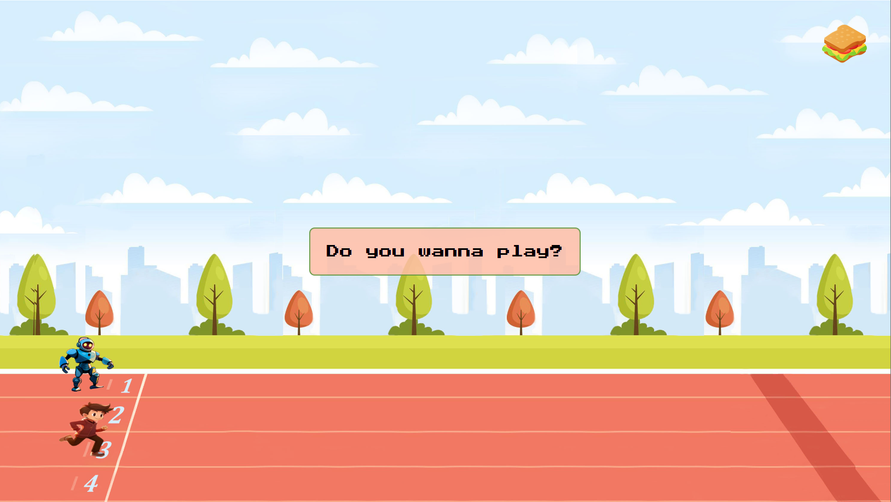
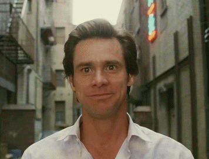
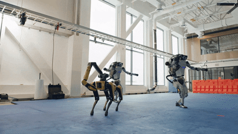

# Fight the robot - Mini game
[The Odin Project]: Rock Paper Scissors

## 🔗 Link

- [Live Version](https://barbaradamasdev.github.io/Rock-Paper-Scissors/)

## ⚔️ The challenge

This is my first creation, a project in HTML, CSS and JS, a challenge from [The Odin Project](https://www.theodinproject.com).
The objective of this challenge was to interactive with JavaScript and use it with the game Rock, Paper and Scissors.

The idea was good and I know the execution could (always) be better, but I'm rigth now very excited to do this!

## 💾 Technologies Used:

- HTML
- CSS
- Responsive layout
- JavaScript
- DOM
- Visual Studio Code

## 🪚 Tools and credits

- Icons:
  - [Icons8](https://icons8.com.br/) and [Flaticon](https://www.flaticon.com/)
- Font: [Press Start 2P](https://fonts.google.com/specimen/Press+Start+2P)
- Trophy img: [Freepik](https://br.freepik.com/psd-gratuitas/copa-do-trofeu-icone-isolado-3d-render-ilustracao_28991002.htm#query=trofeu&position=0&from_view=search&track=sph)
- Sounds: RockNRoll Racing game
- Image generator: [Blue Willow AI](https://www.bluewillow.ai/)
  - with the prompt: 
    - "a cute character game , running. illustration, disney, pixar"
    - "a cute robot character game , running. illustration, disney, pixar"
    
## 🐼 Author

Bárbara Damasceno - barbaradamas.dev@gmail.com

